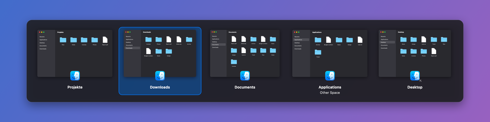

# Para

> Para is a tiny macOS menu bar app: a global shortcut opens an overlay of
> **all windows of the current app**, lets you cycle through them, and switches
> to the one you pick — a visual, more capable version of macOS's built-in <kbd>⌘</kbd><kbd>`</kbd>.



It starts in the background, shows no Dock icon, and lives entirely in the menu
bar.

## Features

- **Current app only**: the overlay lists just the windows of the frontmost app,
  showing each window's title.
- **Global shortcut**, default <kbd>⌘</kbd><kbd>§</kbd> (the key above Tab on ISO
  keyboards). Fully configurable.
- **Hold-and-cycle**: keep the modifier held, tap the key to
  advance, release the modifier to switch.
- **Reverse cycling** with <kbd>⇧</kbd> added to the shortcut.
- **Sticky mode** when the shortcut has no modifier (or you open it from the
  menu) — the overlay stays up until you confirm or cancel.
- **Mouse support**: hover to select, click to switch.
- **Menu bar only** — no Dock icon, no window clutter.
- **Launch at login** toggle.
- Optionally include **minimized/hidden** windows and windows on **other Spaces**.
- Optional **window previews**: live thumbnails of each window instead of just
  the app icon (Settings → *Show window previews*, macOS 14+).

## Install

Download `Para-<version>.zip` from the
[Releases](../../releases) page, unzip it and move `Para.app` to
`/Applications`.

Builds without a Developer ID signature are blocked by Gatekeeper on first
launch. Either right-click `Para.app` → **Open** → **Open**, or run:

```sh
xattr -dr com.apple.quarantine /Applications/Para.app
```

## Build

Requires macOS 13+ and a Swift 5.9+ toolchain (Xcode command line tools).

```sh
./build.sh
open build/Para.app
```

`build.sh` compiles a release build, assembles `build/Para.app` and ad-hoc signs
it. Useful environment variables:

| Variable | Effect |
| --- | --- |
| `UNIVERSAL=1` | Build a universal (arm64 + x86_64) binary |
| `CODESIGN_IDENTITY="Developer ID Application: …"` | Sign with a real identity instead of ad-hoc |
| `VERSION=1.2.0` / `BUILD_NUMBER=42` | Stamp the version into `Info.plist` |
| `PACKAGE=1` | Also create `build/Para-<version>.zip` and its SHA-256 |

To run it permanently, move `Para.app` to `/Applications` and enable **Launch at
login** in its settings.

The app icon is generated by `swift scripts/make-icon.swift`, which writes
`Resources/Para.icns`. The README screenshot is rendered from the real overlay
view with
`.build/release/Para --render-screenshot docs/screenshot.png --previews`
(using mock window artwork).

## Releasing

Releases are built by GitHub Actions (`.github/workflows/release.yml`) whenever a
`v*` tag is pushed:

1. Add a `## [x.y.z]` section to `CHANGELOG.md` and bump
   `CFBundleShortVersionString` in `Resources/Info.plist`.
2. Commit, then `git tag vx.y.z && git push origin main --tags`.

The workflow builds a universal binary, zips it, and publishes a GitHub release
using the matching changelog section as notes.

**Signing and notarization (optional, recommended).** Without the secrets below
the release is ad-hoc signed and users must bypass Gatekeeper once. With an
Apple Developer Program membership, add these repository secrets to get a
Developer ID signed, notarized and stapled build:

| Secret | Value |
| --- | --- |
| `DEVELOPER_ID_CERT_P12` | Base64 of the exported *Developer ID Application* `.p12` |
| `DEVELOPER_ID_CERT_PASSWORD` | Password of that `.p12` |
| `DEVELOPER_ID_IDENTITY` | e.g. `Developer ID Application: Jane Doe (TEAMID)` |
| `NOTARY_APPLE_ID` | Apple ID used for notarization |
| `NOTARY_TEAM_ID` | Your 10-character team ID |
| `NOTARY_PASSWORD` | An app-specific password for that Apple ID |

Para is not distributed through the Mac App Store: App Store apps must be
sandboxed, and sandboxed apps cannot use the Accessibility API to raise other
apps' windows.

## Permissions

Para needs **Accessibility** permission to read window titles and to raise the
window you select:

**System Settings → Privacy & Security → Accessibility → enable Para**

It will ask on first use. The global shortcut itself works without any
permission (it uses Carbon's `RegisterEventHotKey`).

Without Accessibility, Para cannot read window titles or raise a specific window,
so instead of the overlay it shows an alert pointing you to System Settings; the
menu bar menu also shows a “Grant Accessibility Permission…” item.

**Window previews** (off by default) additionally need Screen Recording:

**System Settings → Privacy & Security → Screen & System Audio Recording → enable Para**

Para asks when you turn previews on. macOS only applies the grant after Para is
relaunched (menu bar icon → Quit, then open it again). Until then — or on macOS
13 — the switcher shows app icons.

> **Note on signing:** `build.sh` ad-hoc signs the app with a designated
> requirement pinned to the bundle id (`app.para.switcher`), so the
> Accessibility and Screen Recording grants survive rebuilds. If Para ever
> stops switching windows (all tiles look identical, or you get the permission
> alert), remove Para from the Accessibility list with “−” and add it again.

## Keyboard reference

While the overlay is open:

| Key | Action |
| --- | --- |
| Shortcut key (modifier held) | Next window |
| Shortcut key + <kbd>⇧</kbd> | Previous window |
| <kbd>→</kbd> / <kbd>↓</kbd> | Next window |
| <kbd>←</kbd> / <kbd>↑</kbd> | Previous window |
| <kbd>↩</kbd> | Switch to selection |
| <kbd>esc</kbd> | Cancel |
| Release the modifier | Switch to selection |

## Changing the shortcut

Menu bar icon → **Settings…** → click the shortcut field and press the new
combination. <kbd>esc</kbd> cancels recording, <kbd>⌫</kbd> restores the
default. Combinations already claimed by another app are rejected.

## Troubleshooting

```sh
# Print what the switcher would show for the frontmost app (or a named app),
# and which backend it used
./build/Para.app/Contents/MacOS/Para --list-windows
./build/Para.app/Contents/MacOS/Para --list-windows Finder

# Verify the overlay renders and the shortcut can be registered
./build/Para.app/Contents/MacOS/Para --self-test
```

If `--list-windows` reports `CoreGraphics fallback` while Accessibility appears
to be granted, remove Para from the Accessibility list and re-add it — this
usually happens after a rebuild changed the ad-hoc signature.

## Project layout

```
Package.swift                  SwiftPM manifest (executable target)
build.sh                       Builds, signs and packages build/Para.app
CHANGELOG.md                   Release notes (used by the release workflow)
.github/workflows/             CI build and tag-triggered GitHub release
scripts/make-icon.swift        Generates Resources/Para.icns
Resources/Info.plist           LSUIElement (menu bar / background) bundle config
Resources/Para.icns            App icon
docs/screenshot.png            README screenshot (--render-screenshot)
Sources/Para/
  main.swift                   Entry point + debug/docs flags
  AppDelegate.swift            Status item and menu
  SwitcherController.swift     Triggers, cycling, modifier-release commit
  SwitcherPanel.swift          Non-activating overlay panel and grid view
  WindowLister.swift           Window enumeration (AX + CoreGraphics) and raising
  WindowPreviews.swift         Window thumbnails via ScreenCaptureKit
  HotKeyManager.swift          Carbon global hot key registration
  Settings.swift               Shortcut model and UserDefaults storage
  KeyCodeNames.swift           Layout-aware key labels
  PreferencesWindow.swift      Settings window and shortcut recorder
  LaunchAtLogin.swift          SMAppService wrapper
```

## Acknowledgements

Inspired by [AltTab](https://alt-tab.app/).
